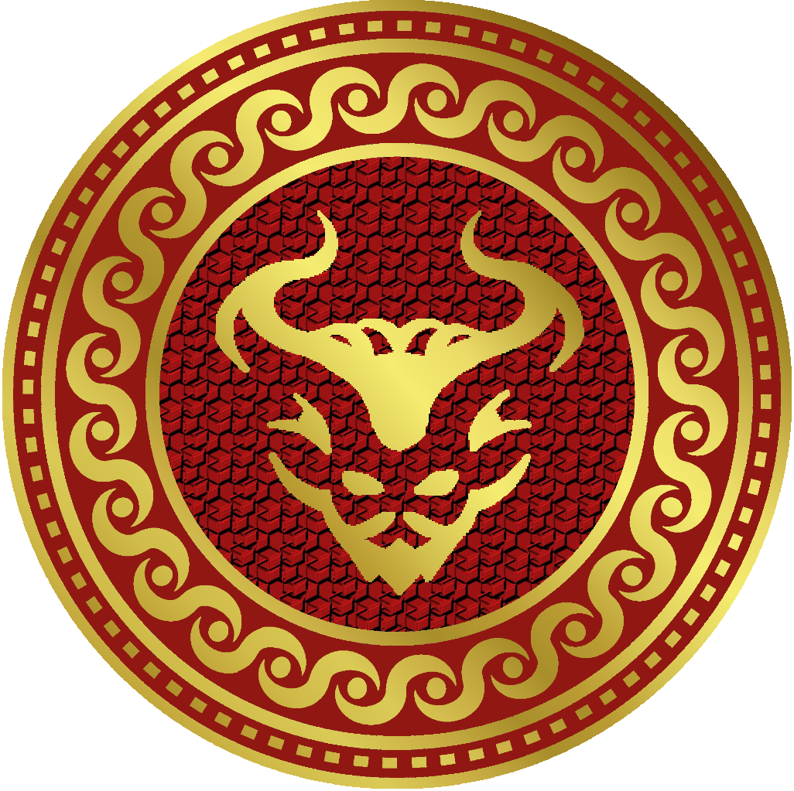

  /#######   /######   /##   /##
 | ##__  ## /##__  ## | ### | ##
 | ##  \ ##| ##  \ ## | ####| ##
 | #######/| ######## | ## ## ##
 | ##____/ | ##__  ## | ##  ####
 | ##      | ##  | ## | ##\  ###
 | ##      | ##  | ## | ## \  ##
 |__/      |__/  |__/ |__/  \__/

Welcome to PAN - the Preconfigured Application Node!

Think of it as a cybersecurity Swiss Army knife, but in Docker form.
One container to rule them all, deploy them all, and defend them all.

Why PAN?
  • Because setting up security tools manually is too much hassle.
  • Because you'd rather focus on security, not troubleshooting dependencies.
  • Because Docker makes everything easier (most of the time).

Start it up, dive in, and begin defending the important things!
If something breaks… well, let's just say it's a feature.